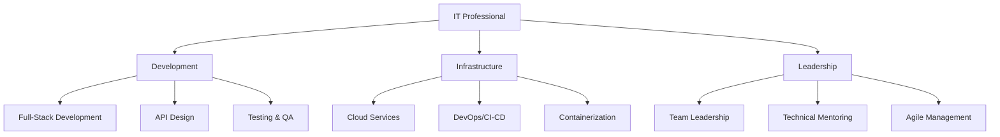

# Welcome to my homepage

## 📱 Full Stack Developer | Cloud Architect | Open Source Contributor

I'm a passionate IT professional with expertise in building scalable applications, architecting cloud infrastructure, and driving technological innovation.

## 🚀 Featured Skills

---

## 💼 Let's Connect!

I'm always interested in discussing technology, collaborating on projects, or exploring new opportunities. Feel free to reach out through:

- **Email**: your.email@example.com
- **GitHub**: [@yourprofile](https://github.com/yourprofile)
- **LinkedIn**: [Your Name](https://linkedin.com/in/yourprofile)
- **Twitter**: [@yourhandle](https://twitter.com/yourhandle)

---

